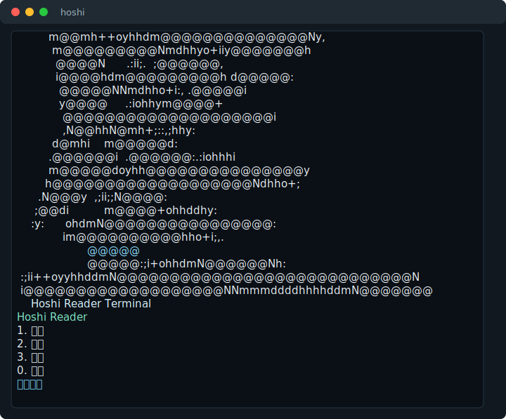
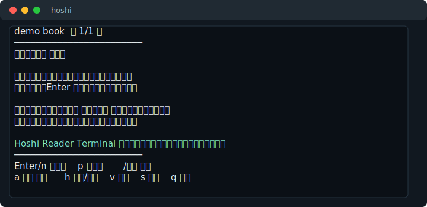
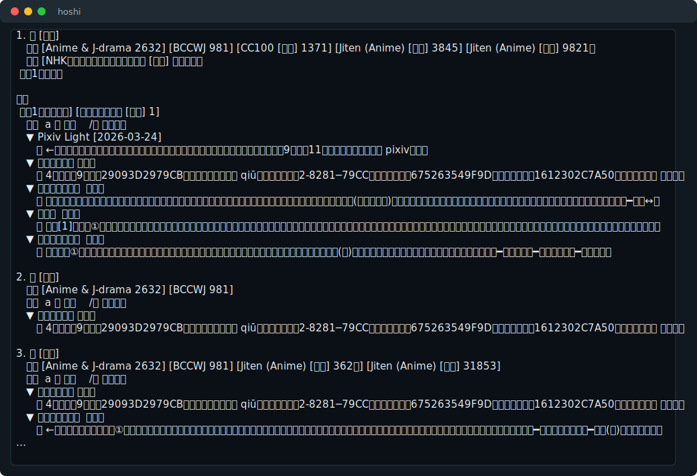
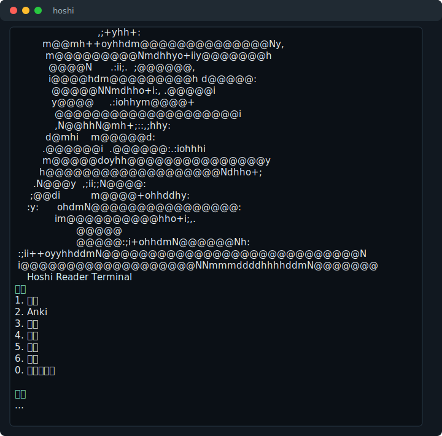
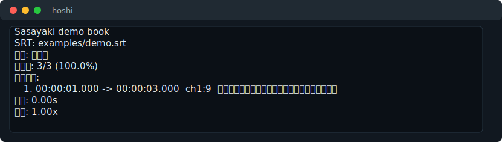

# Hoshi Reader Terminal   

[English](README.md) | **简体中文**

一个受 [Hoshi Reader iOS](https://github.com/Manhhao/Hoshi-Reader) 和 [Hoshi Reader Android](https://github.com/HuangAntimony/Hoshi-Reader-Android) 启发的终端日语 EPUB 阅读器，支持书库、Yomitan 查词、Sasayaki 有声书、Anki 制卡、阅读统计和本地进度同步。

Hoshi Reader Terminal 面向真正的赛博苦行僧：它把小说阅读、查词和制卡全部塞进终端，彻底修复了 Hoshi Reader 过于好用的设计缺陷。

<p align="center">
  
</p>

| 阅读 | 查词 |
| --- | --- |
|  |  |

| 同步 | 设置 |
| --- | --- |
|  |  |

| Sasayaki |
| --- |
|  |

## 功能

### 书库

- 支持导入 `.epub`、`.txt`、`.md`、`.html`、`.xhtml`。
- 支持用书架数字序号、标题片段、id 或文件路径打开书。
- 保存阅读进度、阅读统计、划线和备注。
- 可以在终端菜单里设置默认小说目录。

### 阅读

- 在终端里分页阅读。
- 支持横排和终端竖排显示；竖排按终端 cell 宽度排布，汉字/假名按双宽，常见日文标点用半宽形态对齐。
- 阅读器底部直接显示可照抄的输入例子：
  - `/読みました` 查词
  - `a 読む` 制卡
  - `h 备注` 划线备注

### 查词

- 支持导入 Yomitan Term / Frequency / Pitch 三类词典目录或 zip。
- 可以启用、停用词典，并调整同类词典的查词优先级。
- 可以从查词菜单、命令行、阅读器内部查词。
- 查词结果支持分页，用方向键翻页，并可在结果页继续 `/词` 递归查词。
- 带简单日语活用还原，覆盖常见礼貌形和过去式。

### Sasayaki 有声书

- 复用上游 Sasayaki 的核心流程：解析 SubPlz 生成的 `.srt`，过滤 EPUB/文本正文，按顺序匹配台词并显示匹配率。
- 支持保存每本书的 SRT、音频文件、播放位置、延迟和倍速。
- 阅读器里按 `y` 可以查看当前页匹配台词，并在面板里播放本句、从当前句继续、停止、上一句和下一句。
- 命令行可用 `sasayaki list/play` 查看或播放，`sasayaki play --line` 只播放单条台词时间范围。
- 音频播放优先调用 `mpv`，其次 `ffplay`；倍速播放会为 `ffplay` 自动生成 `atempo` filter 链，没有可 seek 的播放器时退回系统默认打开。

### Anki 制卡

- 可以写入 CSV。
- AnkiConnect 可用时可以直接发卡。
- 可以在设置里调整牌组、模板、字段、标签和 AnkiConnect URL。

### 同步和备份

- 可以通过本地 `ttu-reader-data` 风格同步目录导出/导入进度和统计。
- 备份文件会生成到数据目录外面，不会再把正在生成的备份 zip 打进自己里面。

### 界面

- 输入 `hoshi` 启动主菜单。
- 界面标签支持简体中文、English、日本語。
- 使用参考 Hoshi 图标的 neofetch 风格终端 logo。
- 支持在线检查 GitHub Release 更新，也可以直接更新当前便携安装。

## 下载

从 [GitHub Releases](https://github.com/AkihaZhang/Hoshi-Reader-Terminal/releases/tag/v0.1.10) 下载便携包。推荐用下面的一键脚本安装；zip/tar 便携包本身需要 Python 3.10+。

| 系统 | 安装包 |
| --- | --- |
| Windows | `Hoshi-Reader-Terminal-0.1.10-windows.zip` |
| macOS | `Hoshi-Reader-Terminal-0.1.10-macos.tar.gz` |
| Linux | `Hoshi-Reader-Terminal-0.1.10-linux.tar.gz` |

安装后运行：

```bash
hoshi
```

## 一键安装

```bash
# macOS / Linux
curl -fsSL https://github.com/AkihaZhang/Hoshi-Reader-Terminal/releases/latest/download/install.sh | sh
```

```powershell
# Windows PowerShell
irm https://github.com/AkihaZhang/Hoshi-Reader-Terminal/releases/latest/download/install.ps1 | iex
```

脚本会下载最新 release 的对应系统包并安装 `hoshi` 命令。运行需要 Python 3.10+；如果缺少 Python，脚本会给出提示。

## 命令

```text
菜单                         打开主菜单
导入 PATH                    导入书籍
书架                         查看书架
阅读 TARGET                  按序号、id、标题片段或路径阅读
查词 WORD                    查词
导入词典 PATH                导入 Yomitan 词典 zip 或目录
词典列表 [TYPE]              查看 Term / Frequency / Pitch 词典
词典排序 TYPE FROM TO        调整同类词典优先级
词典开关 TYPE INDEX [状态]   启用或停用词典
制卡 WORD                    写入 CSV 或发送到 AnkiConnect
统计                         查看阅读统计
同步 [auto|export|import]    同步阅读进度
sasayaki status BOOK         查看有声书匹配状态
sasayaki match BOOK SRT      匹配 SRT，可加 --audio 音频
sasayaki list/play BOOK      查看或播放匹配台词
sasayaki play BOOK --line    只播放当前台词时间范围
设置                         打开设置
诊断                         检查运行环境
检查更新                     在线检查新版本
更新 [-y]                    下载 Release 包并替换当前 pyz
```

英文命令 `menu`, `import`, `shelf`, `read`, `lookup`, `dict-import`, `card`, `stats`, `sync`, `settings`, `doctor`, `update` 也可用。只想看版本不安装时运行 `hoshi update --check`。

## 从源码运行

```bash
python3 -m pip install -e .
hoshi
```

不安装直接运行：

```bash
python3 -m hoshi_terminal menu
```

## 数据目录

- Windows: `%APPDATA%\HoshiReaderTerminal`
- macOS: `~/Library/Application Support/HoshiReaderTerminal`
- Linux: `~/.local/share/hoshi-reader-terminal`

便携运行：

```bash
HOSHI_TERMINAL_HOME=.hoshi-terminal python3 -m hoshi_terminal 书架
```

## 开发

```bash
python3 -m unittest discover -s tests
python3 scripts/generate_readme_assets.py
python3 scripts/build_packages.py
```

发布包可以用 `scripts/build_packages.py` 生成。Release 上传三系统便携包和一键安装脚本。

## 隐私和数据

Hoshi Reader Terminal 会把导入的书、词典、制卡 CSV、阅读进度、划线、统计和设置保存在本地数据目录。同步只使用用户设置的本地文件夹。Anki 制卡只会访问你设置的 AnkiConnect 地址。

## 致谢

菜单、阅读、辞典、Sasayaki、Anki 和同步的轮廓参考 Hoshi Reader iOS / Android；能在终端环境里复用的实现思路和交互结构会尽量移植，跨平台终端入口由本仓库 Python 实现。

## License

MIT License，见 [LICENSE](LICENSE)。
