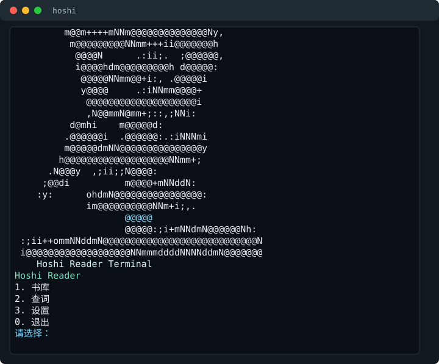
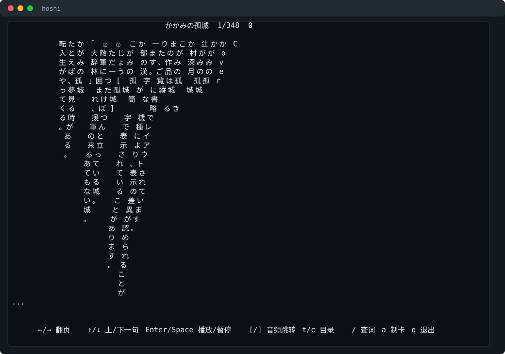
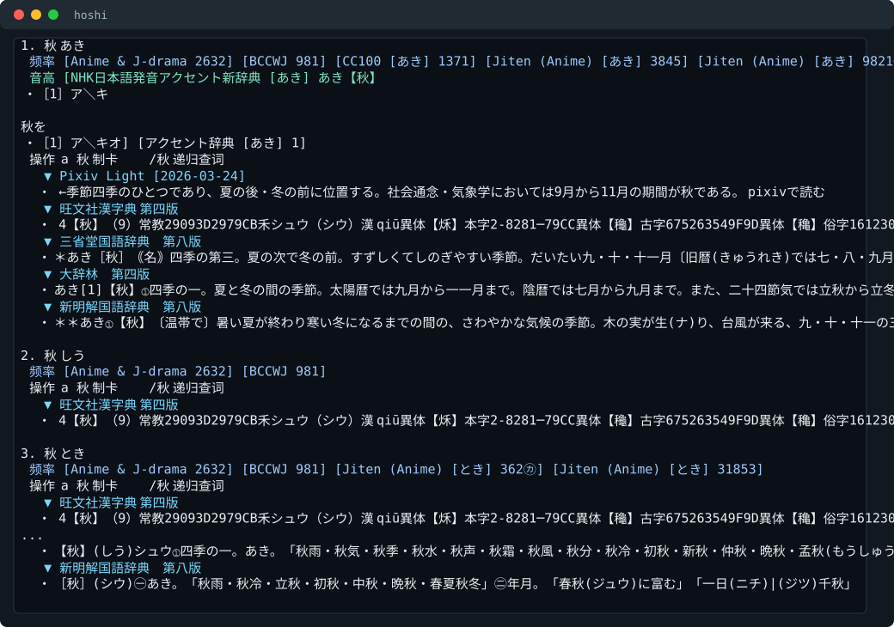
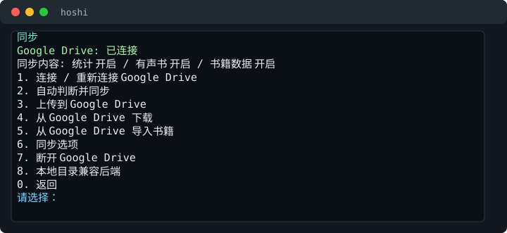
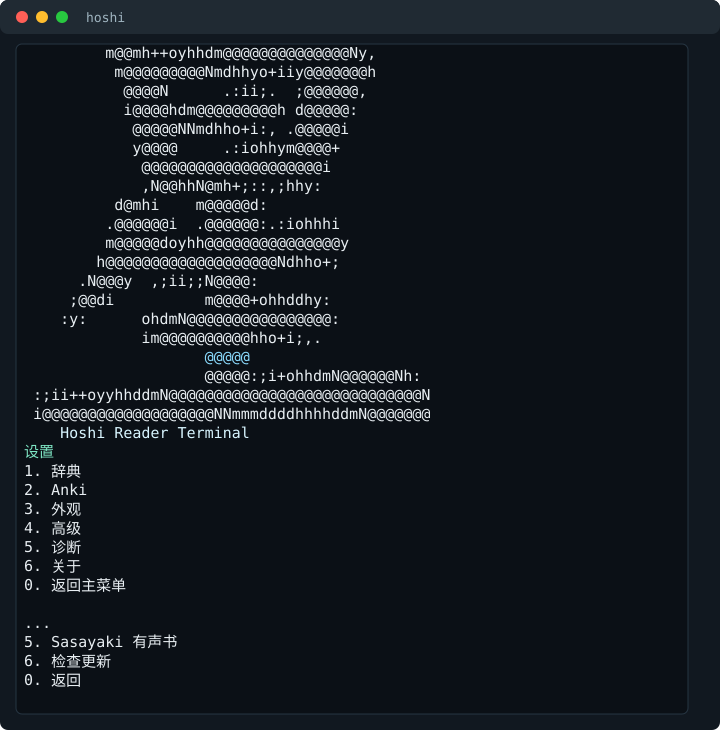
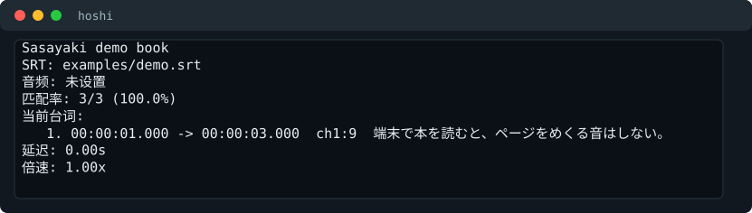

# Hoshi Reader Terminal   

[English](README.md) | **简体中文**

Hoshi Reader Terminal 是一个能在 Windows、macOS 和 Linux 终端里运行的日语阅读器。它提供书库、分页阅读、Yomitan 查词、Anki 制卡、Sasayaki 有声书匹配、阅读统计和基于 Google Drive 的 ッツ/TTU 同步。

终端版会参考 Hoshi Reader iOS 和 Android 的功能结构，只保留在终端里有意义、能稳定使用的交互。

<p align="center">
  
</p>

| 阅读 | 查词 |
| --- | --- |
|  |  |

| 同步 | 设置 |
| --- | --- |
|  |  |

| Sasayaki |
| --- |
|  |

## 功能

- 以书库为阅读入口：导入书籍后从书架打开，支持自定义书架、未归类分组、正在阅读分组和最近阅读/标题排序。
- 书籍上下文支持重命名、删除、标记已读、移动到书架、同步单本进度或启动 Sasayaki 匹配。
- 支持 `.epub`、`.txt`、`.md`、`.html`、`.xhtml`。
- 终端分页阅读，支持方向键翻页、目录跳转、正文搜索、查词、制卡、划线、备注、划线列表跳转、统计、横排和终端竖排。
- 支持导入 Yomitan Term / Frequency / Pitch 三类词典 zip 或目录。
- 支持词典优先级调整、启用/停用、查词结果分页、递归查词和彩色终端 badge。
- 支持 Sasayaki：SubPlz `.srt` 匹配、本地或在线音频、上一句/下一句、句子高亮、播放位置、延迟和倍速。
- 支持 CSV 制卡和 AnkiConnect 制卡，默认字段按 Hoshi/Lapis 风格配置。
- 词语音频支持在线音频源，也支持 Ankiconnect Android `android.db` 本地音频库。
- 支持通过 Google Drive `ttu-reader-data` 同步阅读进度、统计、Sasayaki 播放位置和书籍数据；本地目录后端只作为兼容与调试选项保留。
- 界面标签支持简体中文和 English。
- 支持检查 GitHub Release 更新，也可以更新当前便携安装。

## 安装

推荐使用一键安装脚本：

```bash
# macOS / Linux
curl -fsSL https://github.com/AkihaZhang/Hoshi-Reader-Terminal/releases/latest/download/install.sh | sh
```

```powershell
# Windows PowerShell
irm https://github.com/AkihaZhang/Hoshi-Reader-Terminal/releases/latest/download/install.ps1 | iex
```

安装后运行：

```bash
hoshi
```

三系统便携包在 [GitHub Releases](https://github.com/AkihaZhang/Hoshi-Reader-Terminal/releases/tag/v0.1.20)：

| 系统 | 安装包 |
| --- | --- |
| Windows | `Hoshi-Reader-Terminal-0.1.20-windows.zip` |
| macOS | `Hoshi-Reader-Terminal-0.1.20-macos.tar.gz` |
| Linux | `Hoshi-Reader-Terminal-0.1.20-linux.tar.gz` |

运行需要 Python 3.10 或更高版本。

## 常用命令

```text
hoshi                         打开终端菜单
hoshi 导入 PATH               导入书籍
hoshi 书架                    查看书架；输入数字阅读
hoshi 阅读 TARGET             按序号、id、标题片段或路径阅读
hoshi 查词 WORD               查词
hoshi 导入词典 PATH           导入 Yomitan 词典
hoshi 词典列表 [TYPE]         查看 Term / Frequency / Pitch 词典
hoshi 词典排序 TYPE FROM TO   调整词典优先级
hoshi 制卡 WORD               写入 CSV 或发送到 AnkiConnect
hoshi 同步 connect            连接 Google Drive
hoshi 同步 status             查看连接状态
hoshi 同步 [auto|export|import]
hoshi 同步 books              查看远端 TTU 书库
hoshi 同步 get --book BOOK    从 bookdata 导入书籍
hoshi 同步 local --path PATH  使用本地兼容后端
hoshi 有声书 status BOOK
hoshi 有声书 match BOOK SRT --audio AUDIO
hoshi 设置
hoshi 检查更新 --check
hoshi 更新 -y
```

英文命令 `menu`, `import`, `shelf`, `read`, `lookup`, `dict-import`, `card`, `stats`, `sync`, `sasayaki`, `settings`, `doctor`, and `update` 也可用。

## Google Drive / ッツ 同步

1. 在 Google Cloud 项目中启用 Google Drive API，并为 `https://www.googleapis.com/auth/drive.file` 配置权限。
2. 创建类型为 **TV 和受限输入设备** 的 OAuth 客户端。
3. 运行 `hoshi 同步 connect`，输入 Client ID 和 Client Secret。
4. 浏览器会打开 Google 的设备授权页；输入终端显示的授权码。
5. 之后运行 `hoshi 同步 auto`，或从“设置 -> 高级 -> 同步”操作。

OAuth 凭据保存在应用数据目录的 `google_drive_auth.json`，在 macOS/Linux 上权限设为 `0600`。该文件不会进入 Hoshi Reader Terminal 的备份包。

## 数据目录

- Windows: `%APPDATA%\HoshiReaderTerminal`
- macOS: `~/Library/Application Support/HoshiReaderTerminal`
- Linux: `~/.local/share/hoshi-reader-terminal`

## License

Distributed under the GNU General Public License v3.0. See [LICENSE](LICENSE) for details.
